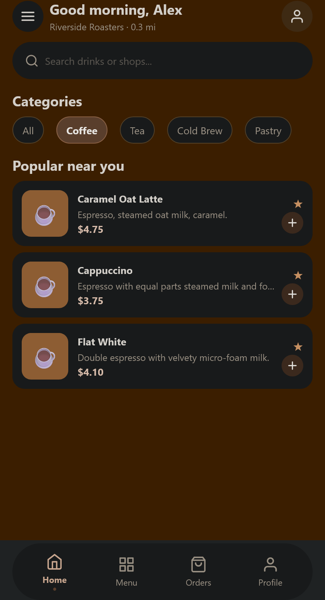
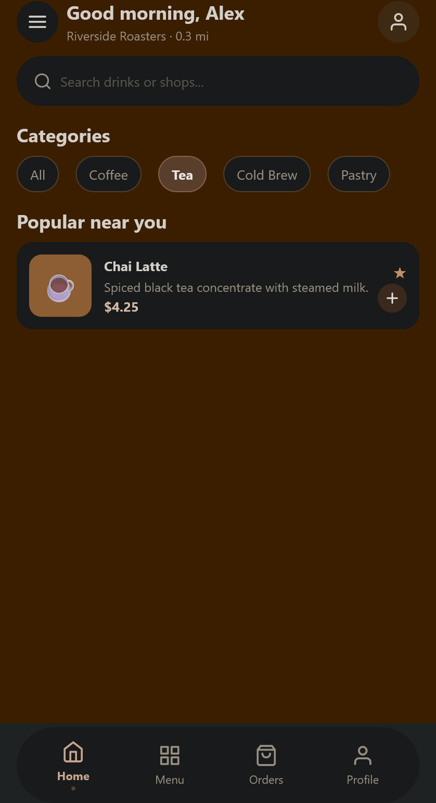
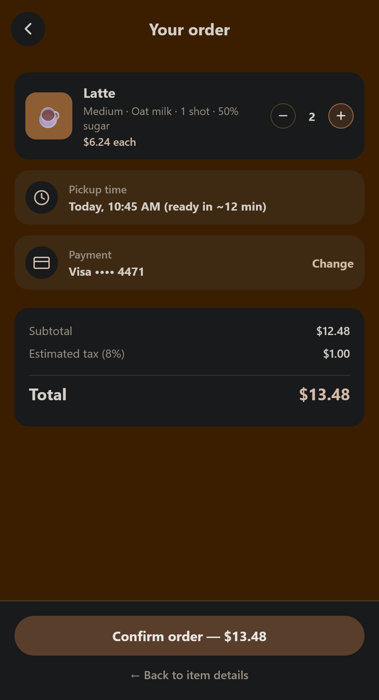
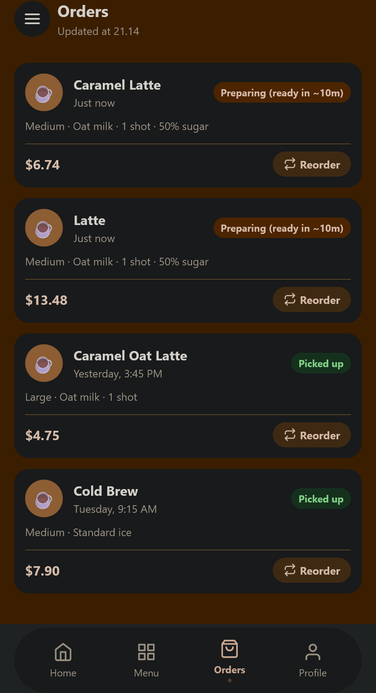
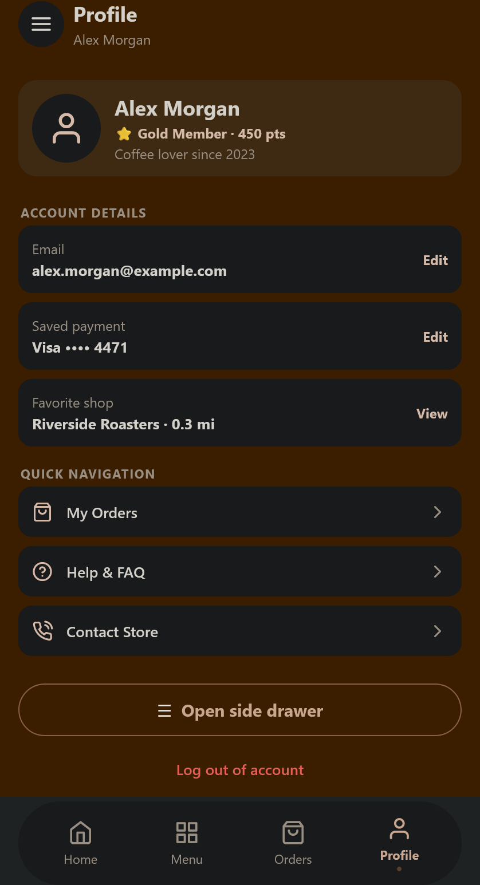

# BrewGo — React Native (Cross Assignment 5)

Мобільний застосунок кав’ярні **BrewGo**, створений на **React Native (Expo)**. 
У цьому завданні реалізована робота з даними та зовнішнім API (отримання списку кавових напоїв, обробка станів завантаження/помилок, вивід через `FlatList`).

## 🚀 Інструкція із запуску

```bash
# 1. Встановлення залежностей
npm install

# 2. Запуск Expo розробки
npx expo start
```

Після запуску натисніть:
- `a` — емулятор Android.
- `i` — симулятор iOS.
- Або відскануйте QR-код через застосунок **Expo Go** на смартфоні.

## 📸 Скриншоти

| Меню з даними API | Деталі напою з API | Оформлення |
| :---: | :---: | :---: |
|  |  |  |

| Головний екран | Замовлення | Профіль |
| :---: | :---: | :---: |
|  |  |  |

## 📦 Здача

1. Завантажте код до вашого **Git-репозиторію**.
2. Створіть архів проекту (без папки `node_modules` та `.expo`):
   - Назва архіву: **`[Ваше прізвище]_cross_assignment_5.zip`**
3. Прикріпіть посилання на Git-репозиторій та архів `.zip` в LMS.
