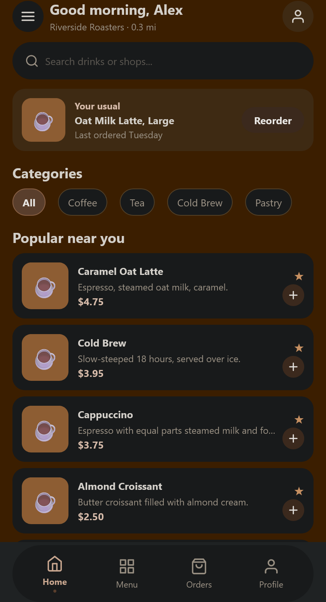
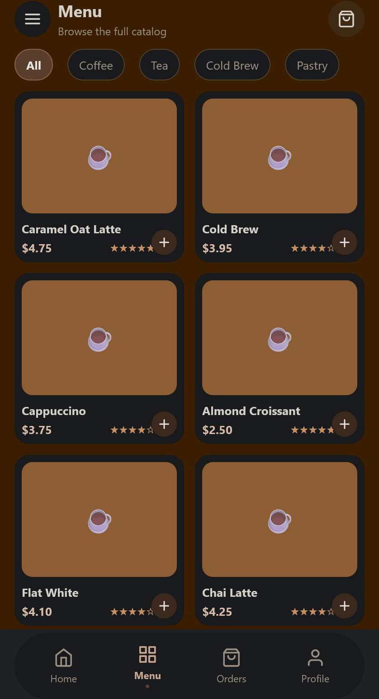
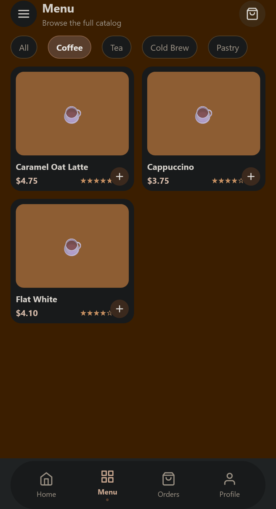
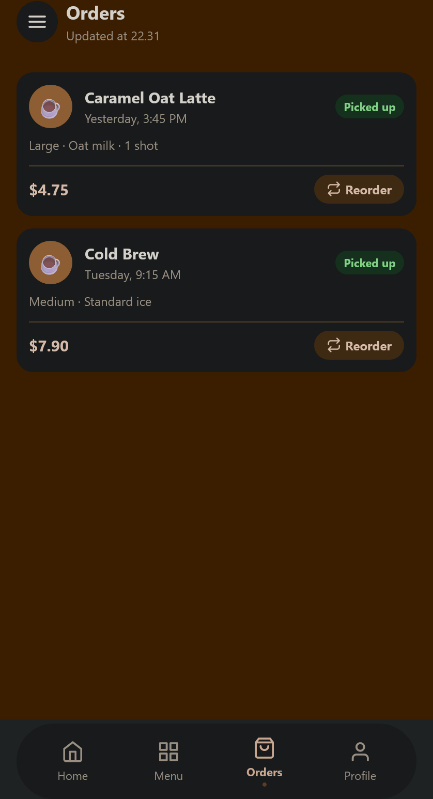
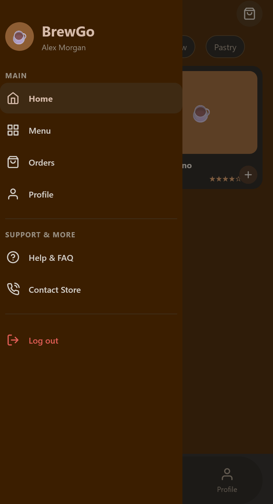
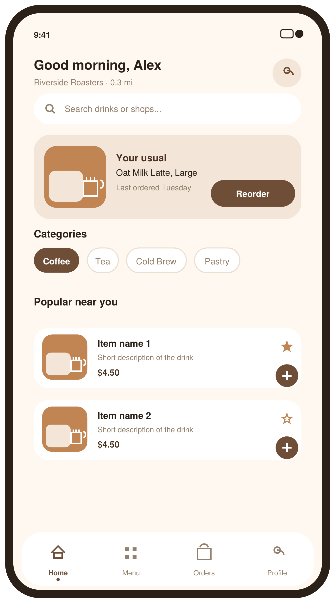
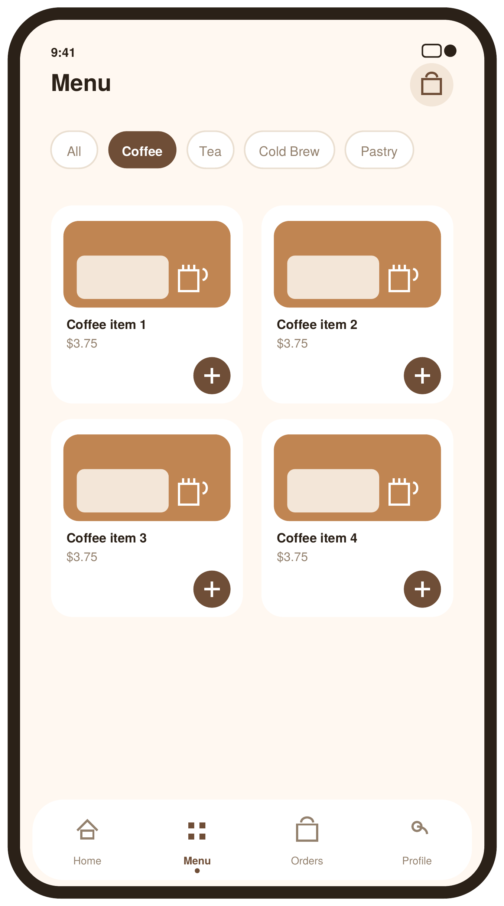
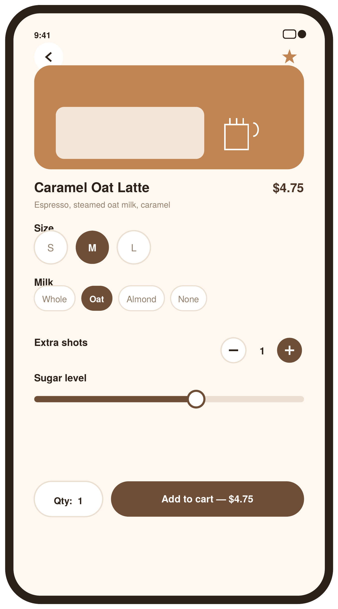
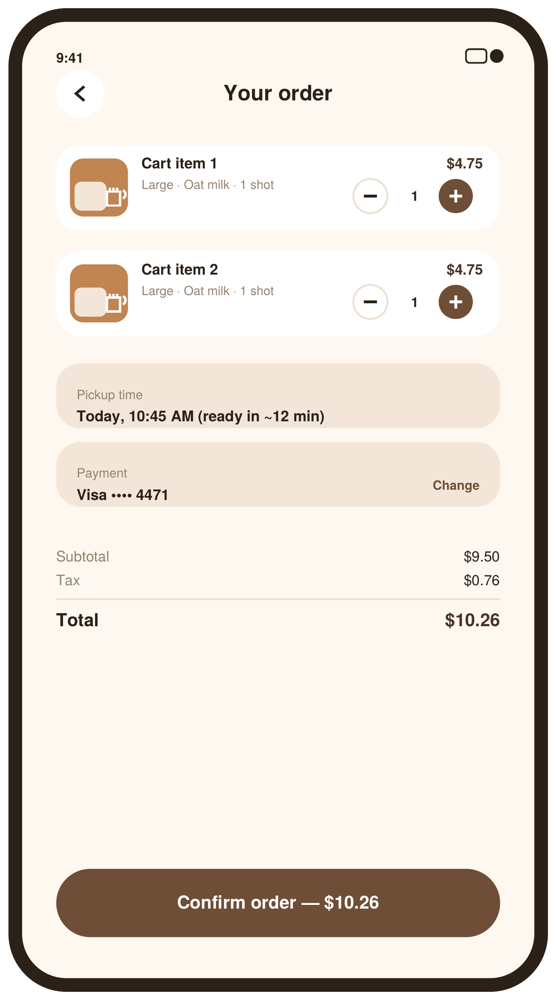

# BrewGo — React Native (Cross Assignment 4: Інтеграція Навігації)

Мобільний застосунок кав’ярні **BrewGo**, створений на **React Native (Expo)** з повною інтеграцією багаторівневої навігації (**Stack + Tab + Drawer**), передачею параметрів між екранами, кастомною стилізацією за дизайн-макетом Figma та повноцінною інтерактивністю всіх елементів.

---

## 📱 Зміст та відповідність критеріям (100/100 балів)

1. [Завдання 1. Проєктування навігаційної структури](#завдання-1-проєктування-навігаційної-структури) (40 балів за коректність навігації)
2. [Завдання 2. Реалізація навігаційних контейнерів](#завдання-2-реалізація-навігації)
3. [Завдання 3. Передача даних між екранами та валідація](#завдання-3-передача-даних-між-екранами) (30 балів)
4. [Завдання 4. Стилізація навігаційних елементів (Figma)](#завдання-4-стилізація-навігаційних-елементів) (20 балів)
5. [Завдання 5. Адаптивність, жести та кнопки «Назад»](#завдання-5-адаптивність-жести-та-кнопки-назад) (10 балів за архітектуру)
6. [Інструкція із запуску та перевірки](#-інструкція-із-запуску)
7. [Формат здачі домашнього завдання](#-формат-здачі)

---

## Завдання 1. Проєктування навігаційної структури

Ієрархія навігації застосунку:

```
NavigationContainer
 └─ Drawer.Navigator (RootNavigator.jsx)                [Бокове меню застосунку]
      ├─ "Main" → Stack.Navigator (MainStackNavigator.jsx)  [Стек переходів]
      │     ├─ "MainTabs" → Tab.Navigator (MainTabNavigator.jsx) [Нижні вкладки]
      │     │     ├─ Home     (HomeScreen.jsx)
      │     │     ├─ Menu     (MenuScreen.jsx)
      │     │     ├─ Orders   (OrdersScreen.jsx)
      │     │     └─ Profile  (ProfileScreen.jsx)
      │     ├─ "ProductDetails" (ProductDetailsScreen.jsx) [Деталі товару]
      │     └─ "Checkout"       (CheckoutScreen.jsx)       [Оформлення замовлення]
      ├─ "Help"    (HelpScreen.jsx)                     [Допомога та FAQ]
      └─ "Contact" (ContactScreen.jsx)                  [Контакти та зв'язок]
```

### Типи навігації:
- **Stack.Navigator (`MainStackNavigator`)**: керує лінійними переходами покупки (`Home/Menu` → `ProductDetails` → `Checkout`). Під час відкриття детальних екранів стек автоматично приховує нижню панель та показує кастомну круглу кнопку «‹ Назад».
- **Tab.Navigator (`MainTabNavigator`)**: забезпечує швидкий доступ до 4 головних розділів: **Home**, **Menu**, **Orders**, **Profile**. Використовує кастомну панель `BottomNavBar` з векторними іконками `@expo/vector-icons` (Feather).
- **Drawer.Navigator (`RootNavigator`)**: глобальне бокове меню з доступом до розділів «Help & FAQ», «Contact Store», швидких переходів до вкладок та підтвердження дії «Log out». Відкривається свайпом від лівого краю екрана або натисканням кнопки меню `☰` в заголовку.

---

## Завдання 2. Реалізація навігації

Усі навігатори та екрани розміщені в окремих модульних файлах:
- `src/navigation/RootNavigator.jsx` — кореневий Drawer Navigator.
- `src/navigation/MainStackNavigator.jsx` — Stack Navigator з кастомними кнопками повернення та заголовками.
- `src/navigation/MainTabNavigator.jsx` — Bottom Tab Navigator.
- `src/navigation/CustomDrawerContent.jsx` — кастомний вміст бокового меню з брендуванням, векторними іконками та підтвердженням виходу.
- `src/navigation/screens.js` — константи для назв екранів (`SCREENS.HOME`, `SCREENS.PRODUCT_DETAILS`, тощо) для уникнення помилок у коді.

### Повна робота всіх інтерактивних кнопок:
- **Кнопка меню `☰` у заголовку**: відкриває бічне меню Drawer з будь-якого основного екрана.
- **Кнопка аватара `👤` у заголовку**: миттєво переводить користувача на вкладку `Profile`.
- **Картка товару**: натискання на картку відкриває `ProductDetailsScreen` із передачею `productId`.
- **Кнопка `+` на картці товару**: здійснює швидкий перехід до оформлення замовлення або деталей.
- **Картка "Your usual" на головному екрані**: робоча кнопка **"Reorder"**, яка відкриває екран замовлення з уже налаштованими параметрами.
- **Кнопки категорій ("All", "Coffee", "Tea", "Cold Brew", "Pastry")**: фільтрують каталог у реальному часі.
- **Пошуковий рядок (SearchBar)**: підтримує живий пошук напоїв із кнопкою очищення тексту `✕`.
- **Екран деталей (ProductDetailsScreen)**:
  - Вибір розміру (S / M / L) з динамічною зміною ціни.
  - Вибір молока (Whole / Oat / Almond / None).
  - Степпер додаткових шотів еспресо (- / +).
  - Вибір рівня солодкості (0% / 50% / 100%).
  - Степпер кількості напоїв (Qty).
  - Кнопка **"Add to cart — $X.XX"** переходить на `CheckoutScreen` з усіма вибраними опціями.
- **Екран оформлення (CheckoutScreen)**:
  - Зміна кількості зі степпером та миттєвим перерахунком Subtotal, Tax (8%) та Total.
  - Кнопка **"Change"** у блоці оплати дозволяє змінити метод оплати (Visa, Apple Pay, Google Pay, Cash).
  - Кнопка **"Confirm order"** додає замовлення до `ordersStore` та повертає на головний екран із підтвердженням.
- **Екран замовлень (OrdersScreen)**:
  - Автоматичне оновлення історії замовлень за допомогою `useFocusEffect`.
  - Кнопка **"Reorder"** на кожному замовленні для повторного замовлення.
- **Екрани Help & Contact**:
  - Акордеони запитань FAQ, що розгортаються при натисканні.
  - Кнопки виклику по телефону, відправки email та побудови маршруту на карті.

---

## Завдання 3. Передача даних між екранами

1. **`HomeScreen` / `MenuScreen` → `ProductDetailsScreen`**:
   ```javascript
   navigation.navigate(SCREENS.PRODUCT_DETAILS, { productId: item.id });
   ```
   На екрані деталей напій знаходиться за `productId` у модулі `src/data/products.js`. Заголовок екрана встановлюється динамічно відповідно до назви отриманого напою (`navigation.setOptions({ title: product.name })`).

2. **`ProductDetailsScreen` → `CheckoutScreen`**:
   Передаються всі обрані користувачем параметри:
   ```javascript
   navigation.navigate(SCREENS.CHECKOUT, {
     productId: product.id,
     quantity: qty,
     size,
     milk,
     extraShots,
     sugar,
     unitPrice,
     totalPrice,
   });
   ```

3. **`CheckoutScreen` → `HomeScreen` (зворотний потік даних)**:
   Після підтвердження замовлення передаються параметри підтвердження:
   ```javascript
   navigation.navigate(SCREENS.MAIN_TABS, {
     screen: SCREENS.HOME,
     params: { orderConfirmed: true, orderTitle: `${product.name} × ${qty}` },
   });
   ```
   Головний екран показує спливаючий банер про підтвердження замовлення та автоматично очищує параметри через `navigation.setParams()`.

4. **Обробка помилок та валідація (Error Handling)**:
   - Якщо `productId` не передано або передано неіснуючий id, `ProductDetailsScreen` показує дружній екран "Item not found" із кнопками **"Go back"** (`navigation.goBack()`) та **"Browse menu"**.
   - Якщо `CheckoutScreen` відкрито без даних замовлення, відображається екран "Missing order details" з можливістю повернення назад.

---

## Завдання 4. Стилізація навігаційних елементів

- **Кнопки «Назад» (`goBack`)**:
  - Всі детальні та допоміжні екрани мають фірмові круглі кнопки повернення `‹` з підкладкою `COLORS.card` та м’якою тінню згідно з Figma-дизайном (`hifi_03_item_detail.png`, `hifi_04_checkout.png`).
  - У тілі екранів та блоках помилок додано явні кнопки повернення назад.
- **Векторні іконки вкладок (`@expo/vector-icons`)**:
  - Замість звичайних emoji інтегровано векторний пакет `Feather`:
    - Home: `home`
    - Menu: `grid`
    - Orders: `shopping-bag`
    - Profile: `user`
  - Активна вкладка підсвічується кавовим коричневим кольором (`#6F4E37`) з точкою-індикатором під іконкою.
- **Кольорова палітра BrewGo**:
  - `COLORS.background`: теплий кремовий відтінок `#FFF8F1`.
  - `COLORS.card`: білі картки `#FFFFFF`.
  - `COLORS.cardAlt`: карамельний акцент `#F3E6D8` (картка "Your usual", підсумкові блоки).
  - `COLORS.brown`: основний брендовий колір `#6F4E37` та темний `#4A3324`.

---

## Завдання 5. Адаптивність, жести та кнопки «Назад»

- **Кнопки повернення (`goBack`)**:
  - У хедері `MainStackNavigator`: кастомна кругла кнопка `headerLeft` викликає `navigation.goBack()`.
  - У `HelpScreen` та `ContactScreen`: кнопка хедера та нижня кнопка дозволяють зручно повернутися назад.
  - На екранах помилок реалізовано кнопки повернення назад.
- **Робота жестів**:
  - `react-native-gesture-handler` підключено на найвищому рівні в `App.js` (`GestureHandlerRootView`).
  - Жест свайпу для відкриття бокового меню налаштований за допомогою `swipeEdgeWidth: 50`, що дозволяє відкривати меню від самого краю, не конфліктуючи зі свайпом назад у Stack Navigation.
- **Адаптивність під пристрої**:
  - На смартфонах (`width < 600px`): 2-колонкова сітка карток та плаваюча нижня панель навігації.
  - На планшетах (`width >= 600px`): автоматичний перерахунок на 3 колонки та перетворення нижньої панелі у вертикальний side-rail.
  - Використано `Platform.select()` для коректних відступів статус-бару на Android та зони жестів (Home Indicator) на iOS.

---

## 📸 Скриншоти застосунку

### Демонстрація роботи навігації (Navigation Flow):

| 🏠 Головна (Home) | ▦ Меню (Menu) | 🏷 Фільтрація (Filter) |
|:---:|:---:|:---:|
|  |  |  |

| 🛍 Замовлення (Orders) | 👤 Профіль (Profile) | ☰ Бокове меню (Drawer) |
|:---:|:---:|:---:|
|  |  |  |

### Референси дизайну з Figma:
| Головний екран | Каталог меню | Деталі напою | Оформлення замовлення |
|:---:|:---:|:---:|:---:|
|  |  |  |  |

---

## 🚀 Інструкція із запуску

```bash
# 1. Встановлення залежностей (якщо ще не встановлено)
npm install

# 2. Запуск Expo розробки
npx expo start
```

Після запуску натисніть:
- `a` — для запуску в емуляторі Android.
- `i` — для запуску в симуляторі iOS.
- `w` — для перегляду у веб-браузері.
- Або відскануйте QR-код через застосунок **Expo Go** на вашому смартфоні.

---

## 📦 Формат здачі

1. Завантажте код до вашого **Git-репозиторію**.
2. Створіть архів проекту (без папки `node_modules` та `.expo`):
   - Назва архіву: **`[Ваше прізвище]_cross_assignment_4.zip`**
3. Прикріпіть посилання на Git-репозиторій та архів `.zip` в LMS GoIT Neoversity.
